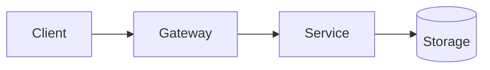

# Title — the system or question being studied

> One sentence: what this is and why it was worth studying.

**Date:** YYYY-MM · **Status:** 🌱 draft · **Area:** distributed-systems / security / ...

## TL;DR

- 3–5 bullets carrying the core insights.
- A reader who stops here should still walk away with the point.

## 1. Context & problem

What the system does, who depends on it, and the constraint that makes the
problem genuinely hard — scale, latency, consistency, adversaries, cost.

## 2. How it works

The architecture and the key flows. Happy path first, then failure paths.
Prefer Mermaid over screenshots:

## 3. Design decisions & trade-offs

| Decision | Alternative(s) | Why this way | What it costs |
|----------|----------------|--------------|---------------|
|          |                |              |               |

## 4. Hands-on *(optional)*

What I built, ran, or measured to check my own understanding — link the code,
show the numbers. This section is the difference between a case study and a
book report.

## 5. Takeaways

What transfers to other systems. What surprised me. What I would do differently.

## References

- [Primary source]() — paper / talk / postmortem / source code
- [Secondary sources]()
