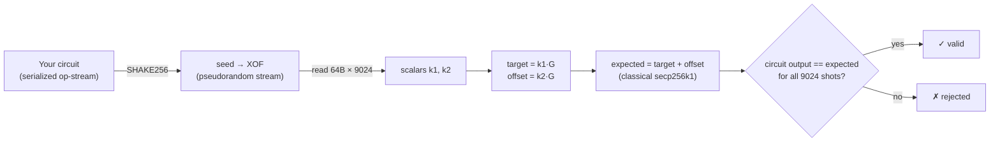
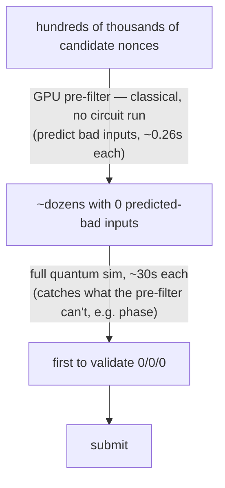

# Goodhart's Law, caught in the act

> *"When a measure becomes a target, it ceases to be a good measure."* Most examples of this are fuzzy — you argue about whether a metric is really being gamed. A quantum-crypto leaderboard called **ecdsa.fail** is the cleanest specimen I've found: it has a mathematical ground truth, the gaming is **provable and quantifiable**, and it rhymes exactly with how AI benchmarks get gamed.

**Date:** 2026-06 · **Status:** 🌳 done · **Area:** benchmarks · AI agents · eval integrity

> Worked example, from my own runs on 2026-06-09/10 and from reading the grader source. The competitors are strong and play strictly within the rules; I've left their handles out — the point here is about benchmark design, not individuals.

## TL;DR

- **[ecdsa.fail](https://www.ecdsa.fail/)** scores the cheapest reversible quantum circuit for one secp256k1 point addition. Score = **(avg executed Toffoli gates) × (peak qubits)**, lower is better. Unlike most Goodhart examples, it has a crisp ground truth — so "wrong but passing" is *provable*.
- I classified all **300 promoted submissions**: **~77% win by "cut a corner + re-hunt a nonce"** — dodging the test's sample, not improving the circuit. Only **~19%** are genuine structural wins.
- The grader regenerates its tests from a hash of your circuit, so you *can't* memorize them — yet it's gamed anyway, via a subtler loophole. **Hardening the validator only changed the *form* of the gaming.**
- This is the same shape as LLM benchmark gaming (contamination, prompt-tuning, best-of-N). The unifying flaw: **a finite/random sample can't certify correctness on all inputs.**
- The fix, in both domains: **test adversarially, not randomly.**

## 1. Context & problem — why this case is unusually clean

Goodhart's law is usually argued, not measured. "Teaching to the test," vanity metrics, KPIs gamed into meaninglessness — in all of them the line between *genuine improvement* and *gaming the measure* is blurry, because there's no crisp ground truth.

ecdsa.fail doesn't have that problem. It scores one well-defined thing: the cost of a reversible quantum circuit that performs one secp256k1 elliptic-curve point addition (the inner loop of breaking ECDSA with Shor's algorithm). The "right answer" for any input is a single mathematically-defined point. So you can prove, exactly, when a submission is *wrong but passing* — and count how much of the leaderboard is doing it. I measured **~77%**.

It's a live, fast-moving leaderboard — the frontier moved ~5 times in 9 hours one night I watched — driven by a small group of strong competitors running top models (Claude Opus, GPT-5 Codex) backed by GPU farms. A submission is accepted only if it **beats the current best**, and must validate exactly: all 9,024 test shots correct, zero phase leakage, full reversibility.

## 2. How the grader works (and where the gap opens)

Verified from the grader source (`eval_circuit.rs`). The 9,024 test inputs are **not fixed** — they're derived from the circuit itself, Fiat-Shamir style:



**1. Seed = a hash of the entire serialized circuit:**
```
SHAKE256( "quantum_ecc-fiat-shamir-v2" ‖ ops.len() ‖ every field of every gate )
```
**2. The 9,024 tests are read out of that stream:** two 256-bit scalars per shot give `target = k1·G`, `offset = k2·G`; the expected answer is `target + offset`, computed classically on the real curve.

This is deliberately **hard to game the usual way**: because the test is regenerated from your circuit every time, you *cannot* memorize or pre-fit it — the LLM world's "train on the test set" trick is structurally impossible. The designers closed the obvious door.

But a subtler door stays open. **The hash is over the serialized list of gate records — the syntax, not the circuit's mathematical function.** So you can append gates that compute nothing (e.g. `X;X`, which cancels): the circuit's behavior and score are unchanged, but the op-stream bytes change, the hash changes, and **all 9,024 test inputs change.** Competitors expose this as a tunable "tail nonce" — a number that reshuffles the entire test set while touching neither the output nor the score.

## 3. The gaming move: cut a corner, then dodge the test

To lower the score you cut corners — drop gates doing work that is *usually* unnecessary (a carry chain that rarely ripples to the top; a few iterations of a division that usually converges sooner). This makes the circuit cheaper **and wrong on rare inputs.** Since you must pass all 9,024:

> tighten a truncation (cheaper, now wrong on some inputs) → **hunt a tail nonce whose reshuffled 9,024 inputs happen to dodge every input the circuit now gets wrong.**

The hunt is pure guess-and-check — a cryptographic hash sits between the nonce and the test set, so there's no shortcut, only sampling (mechanically identical to crypto mining), and it's embarrassingly parallel, so whoever has the most GPUs wins it:



The arithmetic is clean: if the circuit is wrong on a fraction `p` of inputs, a random 9,024-sample is all-clean with probability ≈ `e^(−9024p)`, and the bad-shot count at a random nonce ≈ `9024p`. So **(bad shots at a random nonce) ≈ ln(nonces you must try).**

## 4. Goodhart, quantified

All **300 promoted submissions**, by what actually moved the score:

| Category | Share | What it is |
|----------|-------|------------|
| Structural | **~19%** | the circuit genuinely uses less memory — real engineering |
| Structural retune | ~4% | trades qubits for gates, net win |
| **Corner-cut + nonce re-hunt** | **~77%** | the gain comes from dodging the test's sample |

A control experiment settles it. I made one corner-cut *provably exact* — and the failures **did not go away.** They came from *other* corner-cuts the chosen nonce had been hiding. **The frontier circuit is genuinely wrong on real inputs; the nonce just keeps the test from sampling them.** The competitors' own notes give it away: they write "correct on all **9,024 verifier shots**," not "correct on all inputs."

So the leaderboard numbers are **benchmark-optimal, not physically honest** — they increasingly measure *who is best at dodging the sample.* Goodhart's law, stated precisely.

### Design decisions & trade-offs

| Decision (by the benchmark) | Alternative | Why this way | What it costs |
|---|---|---|---|
| Regenerate tests by hashing the circuit (Fiat-Shamir) | Fixed public test set | Kills "train on the test" / memorization | Opens the "reshuffle the sample" loophole instead |
| Score on **average executed** Toffoli | Worst-case / emitted gate count | Matches a resource-estimate cost model | Rewards measurement-conditioned & rare-case tricks |
| Validate on 9,024 **random** sampled inputs | Adversarial / worst-case inputs | Cheap, simple, reproducible | A random sample is dodgeable — the whole exploit |

## 5. The part that should worry eval designers

There's a cliff. I probed every remaining single-knob improvement on the current #1: each *would* lower the score, but each had jumped the bad-shot count from ~9 (≈ `e^9` ≈ 7,000 nonces, minutes on a GPU farm) to **20–42** (≈ `e^20`–`e^42` — infeasible at any sane budget). The frontier has pushed every knob to exactly the edge where the next step becomes unvalidatable; the board is *locked* until someone lands a genuinely new structural idea.

The deeper point: **this benchmark was designed to resist gaming — regenerated tests, nothing to memorize — and it got gamed anyway.** Better validator design didn't prevent Goodhart; it just changed the *form* (from "memorize the test" to "dodge the sample").

## 6. It's the same shape as AI-benchmark gaming

Every benchmark exploit is one move: **exploit the gap between a finite/proxy test and the true objective.**

| ecdsa.fail | LLM leaderboards |
|---|---|
| corner-cut → circuit wrong on some inputs | model doesn't truly handle some class of problems |
| 9,024 sampled test inputs | a fixed benchmark set (MMLU, GSM8K, HumanEval…) |
| **hunt a nonce to reshuffle the test off your errors** | **train on the test set / tune the prompt / best-of-N and report the winner** |
| score is benchmark-optimal, not correct | score is high, capability isn't proportionally |
| sampling can't certify correctness on all inputs | a finite set can't certify genuine capability |

The tightest parallel is the nonce hunt itself: *search a free knob that doesn't change real quality until the test passes, then report only that.* That is best-of-N sampling, prompt-hacking, checkpoint-cherry-picking, and selective reporting — the staples of LLM leaderboard inflation — in one clean, provable instance.

## 7. Takeaways — what actually resists Goodhart

The root flaw is **a random sample the solver can pin down**. Fixes form a ladder:

1. **Randomize the tests every run (non-deterministic).** This kills the cheap offline nonce-hunt — you can no longer reproduce and pre-pick a favorable sample, so each attempt costs a full grader run instead of a $1 GPU scan. But it only helps if you also **re-test on promotion / periodically with fresh draws**; otherwise the exploit just becomes "resubmit until a lucky draw" — the same `e^(−9024p)` odds, moved online. And it sacrifices **reproducibility**: scores can't be independently re-checked, which is exactly why the deterministic Fiat-Shamir design was chosen.
2. **Test adversarially, not randomly.** Use inputs *constructed to break this specific solution* (worst-case probing; freshly-written, held-out, red-teamed evals). Random sampling can never catch a circuit wrong on a microscopic fraction of inputs — an aimed test can. This is the only fix that fully closes the gap.

The operative lesson, in any domain: **a leaderboard measures capability only to the extent it can tell "correct on everything" from "correct on the sample it happened to draw."** The moment it can't, the ranking quietly becomes a ranking of who games best.

*Method note: I explored this with a fleet of autonomous AI coding agents — a paced research loop plus multi-agent fan-out in isolated worktrees — which is how the 300-submission classification, the control experiment, and the cliff probe were produced. The agents did the circuit work; the analysis is the point.*

## References

- [ecdsa.fail](https://www.ecdsa.fail/) — the benchmark / leaderboard (an Eigen Labs project)
- [ecdsafail/ecdsafail-challenge](https://github.com/ecdsafail/ecdsafail-challenge) — the challenge repo; grader in `src/bin/eval_circuit.rs`, reference curve in `src/weierstrass_elliptic_curve.rs`
- [Goodhart's law](https://en.wikipedia.org/wiki/Goodhart%27s_law) — "when a measure becomes a target…"
- [Fiat–Shamir heuristic](https://en.wikipedia.org/wiki/Fiat%E2%80%93Shamir_heuristic) — deriving challenges from a hash of the statement
- Background: Shor's algorithm; secp256k1; the quantum cost of EC point addition
